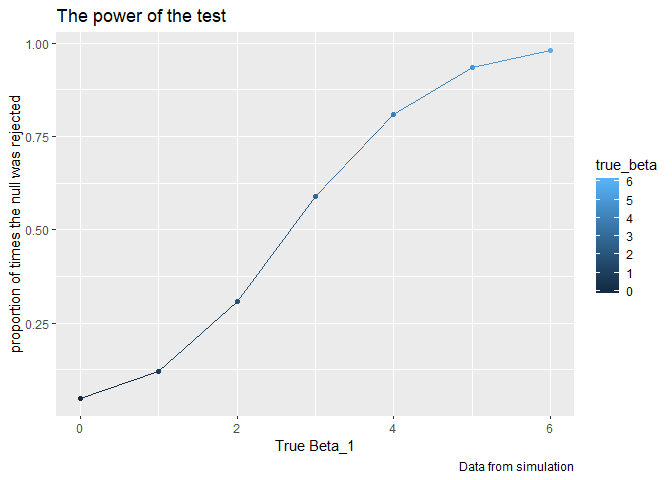

Homework 5
================
Bingkun Luo
11/2/2019

### Problem 1

``` r
set.seed(10)

iris_with_missing = iris %>% 
  map_df(~replace(.x, sample(1:150, 20), NA)) %>%
  mutate(Species = as.character(Species))
```

General glance for the data:

``` r
str(iris_with_missing)
```

    ## Classes 'tbl_df', 'tbl' and 'data.frame':    150 obs. of  5 variables:
    ##  $ Sepal.Length: num  5.1 4.9 4.7 4.6 5 5.4 NA 5 4.4 4.9 ...
    ##  $ Sepal.Width : num  3.5 3 3.2 3.1 3.6 3.9 3.4 3.4 2.9 3.1 ...
    ##  $ Petal.Length: num  1.4 1.4 1.3 1.5 1.4 1.7 1.4 1.5 1.4 NA ...
    ##  $ Petal.Width : num  0.2 0.2 0.2 NA 0.2 0.4 0.3 0.2 0.2 0.1 ...
    ##  $ Species     : chr  "setosa" "setosa" "setosa" "setosa" ...

``` r
kable(head(iris_with_missing),format = "markdown")
```

| Sepal.Length | Sepal.Width | Petal.Length | Petal.Width | Species |
| -----------: | ----------: | -----------: | ----------: | :------ |
|          5.1 |         3.5 |          1.4 |         0.2 | setosa  |
|          4.9 |         3.0 |          1.4 |         0.2 | setosa  |
|          4.7 |         3.2 |          1.3 |         0.2 | setosa  |
|          4.6 |         3.1 |          1.5 |          NA | setosa  |
|          5.0 |         3.6 |          1.4 |         0.2 | setosa  |
|          5.4 |         3.9 |          1.7 |         0.4 | setosa  |

Since there is only two cases for missing value, either numeric or
character, we apply the function below and there is the table for the
final result of replacing iris missing data:

``` r
replace = function(x){
        if (class(x) == "numeric") {replace_na(x, mean(x, na.rm = TRUE))}       
        else if (class(x) == "character") {replace_na(x, "virginica")} 
                }

##apply using map

final_iris = map_df(iris_with_missing, replace)

kable(final_iris,format = "markdown",digits = 3)
```

| Sepal.Length | Sepal.Width | Petal.Length | Petal.Width | Species    |
| -----------: | ----------: | -----------: | ----------: | :--------- |
|        5.100 |       3.500 |        1.400 |       0.200 | setosa     |
|        4.900 |       3.000 |        1.400 |       0.200 | setosa     |
|        4.700 |       3.200 |        1.300 |       0.200 | setosa     |
|        4.600 |       3.100 |        1.500 |       1.192 | setosa     |
|        5.000 |       3.600 |        1.400 |       0.200 | setosa     |
|        5.400 |       3.900 |        1.700 |       0.400 | setosa     |
|        5.819 |       3.400 |        1.400 |       0.300 | setosa     |
|        5.000 |       3.400 |        1.500 |       0.200 | setosa     |
|        4.400 |       2.900 |        1.400 |       0.200 | setosa     |
|        4.900 |       3.100 |        3.765 |       0.100 | setosa     |
|        5.400 |       3.075 |        1.500 |       0.200 | setosa     |
|        4.800 |       3.400 |        1.600 |       0.200 | setosa     |
|        5.819 |       3.075 |        1.400 |       0.100 | setosa     |
|        4.300 |       3.000 |        3.765 |       0.100 | setosa     |
|        5.819 |       4.000 |        3.765 |       0.200 | setosa     |
|        5.700 |       4.400 |        1.500 |       0.400 | setosa     |
|        5.400 |       3.900 |        1.300 |       0.400 | setosa     |
|        5.100 |       3.500 |        1.400 |       1.192 | setosa     |
|        5.700 |       3.800 |        1.700 |       0.300 | setosa     |
|        5.100 |       3.800 |        1.500 |       1.192 | setosa     |
|        5.400 |       3.400 |        1.700 |       0.200 | setosa     |
|        5.100 |       3.700 |        1.500 |       0.400 | virginica  |
|        4.600 |       3.600 |        1.000 |       0.200 | setosa     |
|        5.819 |       3.300 |        3.765 |       0.500 | setosa     |
|        4.800 |       3.400 |        1.900 |       0.200 | virginica  |
|        5.000 |       3.000 |        3.765 |       0.200 | setosa     |
|        5.000 |       3.400 |        1.600 |       0.400 | virginica  |
|        5.200 |       3.500 |        1.500 |       0.200 | setosa     |
|        5.819 |       3.400 |        1.400 |       0.200 | setosa     |
|        4.700 |       3.200 |        1.600 |       0.200 | setosa     |
|        4.800 |       3.100 |        3.765 |       0.200 | setosa     |
|        5.400 |       3.075 |        1.500 |       0.400 | setosa     |
|        5.200 |       3.075 |        1.500 |       0.100 | setosa     |
|        5.500 |       4.200 |        1.400 |       0.200 | setosa     |
|        4.900 |       3.100 |        3.765 |       0.200 | setosa     |
|        5.000 |       3.200 |        1.200 |       0.200 | setosa     |
|        5.500 |       3.500 |        1.300 |       0.200 | setosa     |
|        4.900 |       3.600 |        1.400 |       0.100 | setosa     |
|        4.400 |       3.000 |        1.300 |       1.192 | setosa     |
|        5.100 |       3.400 |        1.500 |       0.200 | setosa     |
|        5.000 |       3.500 |        1.300 |       0.300 | setosa     |
|        4.500 |       3.075 |        1.300 |       1.192 | virginica  |
|        4.400 |       3.200 |        1.300 |       0.200 | setosa     |
|        5.000 |       3.500 |        1.600 |       0.600 | setosa     |
|        5.100 |       3.800 |        1.900 |       0.400 | setosa     |
|        4.800 |       3.000 |        1.400 |       0.300 | virginica  |
|        5.100 |       3.800 |        1.600 |       0.200 | setosa     |
|        4.600 |       3.200 |        3.765 |       0.200 | setosa     |
|        5.300 |       3.700 |        1.500 |       0.200 | setosa     |
|        5.000 |       3.075 |        1.400 |       0.200 | setosa     |
|        7.000 |       3.075 |        4.700 |       1.400 | virginica  |
|        6.400 |       3.200 |        4.500 |       1.500 | versicolor |
|        6.900 |       3.100 |        4.900 |       1.500 | versicolor |
|        5.500 |       2.300 |        4.000 |       1.300 | versicolor |
|        6.500 |       2.800 |        4.600 |       1.500 | versicolor |
|        5.700 |       2.800 |        4.500 |       1.300 | versicolor |
|        6.300 |       3.300 |        4.700 |       1.600 | virginica  |
|        4.900 |       2.400 |        3.765 |       1.000 | versicolor |
|        6.600 |       2.900 |        4.600 |       1.300 | virginica  |
|        5.200 |       2.700 |        3.900 |       1.400 | versicolor |
|        5.000 |       2.000 |        3.765 |       1.000 | versicolor |
|        5.900 |       3.000 |        4.200 |       1.500 | versicolor |
|        6.000 |       2.200 |        4.000 |       1.192 | versicolor |
|        6.100 |       2.900 |        4.700 |       1.400 | versicolor |
|        5.600 |       2.900 |        3.600 |       1.300 | versicolor |
|        6.700 |       3.100 |        4.400 |       1.400 | versicolor |
|        5.600 |       3.000 |        4.500 |       1.500 | versicolor |
|        5.800 |       3.075 |        4.100 |       1.000 | versicolor |
|        6.200 |       2.200 |        4.500 |       1.500 | versicolor |
|        5.600 |       2.500 |        3.900 |       1.100 | versicolor |
|        5.900 |       3.200 |        4.800 |       1.800 | versicolor |
|        5.819 |       2.800 |        4.000 |       1.300 | virginica  |
|        6.300 |       2.500 |        4.900 |       1.500 | versicolor |
|        5.819 |       2.800 |        3.765 |       1.200 | versicolor |
|        6.400 |       2.900 |        4.300 |       1.300 | versicolor |
|        6.600 |       3.000 |        4.400 |       1.400 | versicolor |
|        6.800 |       2.800 |        4.800 |       1.400 | versicolor |
|        6.700 |       3.075 |        5.000 |       1.192 | versicolor |
|        6.000 |       3.075 |        4.500 |       1.192 | versicolor |
|        5.700 |       2.600 |        3.500 |       1.000 | virginica  |
|        5.500 |       2.400 |        3.800 |       1.100 | versicolor |
|        5.819 |       2.400 |        3.700 |       1.000 | versicolor |
|        5.800 |       2.700 |        3.900 |       1.200 | versicolor |
|        6.000 |       2.700 |        5.100 |       1.600 | versicolor |
|        5.400 |       3.000 |        4.500 |       1.500 | versicolor |
|        5.819 |       3.400 |        4.500 |       1.600 | versicolor |
|        6.700 |       3.100 |        4.700 |       1.192 | versicolor |
|        5.819 |       3.075 |        4.400 |       1.300 | versicolor |
|        5.600 |       3.000 |        3.765 |       1.192 | versicolor |
|        5.500 |       2.500 |        4.000 |       1.192 | versicolor |
|        5.500 |       3.075 |        4.400 |       1.200 | versicolor |
|        5.819 |       3.075 |        4.600 |       1.192 | versicolor |
|        5.800 |       3.075 |        4.000 |       1.192 | versicolor |
|        5.000 |       2.300 |        3.300 |       1.192 | virginica  |
|        5.819 |       2.700 |        4.200 |       1.300 | versicolor |
|        5.700 |       3.000 |        4.200 |       1.200 | versicolor |
|        5.700 |       2.900 |        4.200 |       1.300 | versicolor |
|        6.200 |       2.900 |        4.300 |       1.300 | versicolor |
|        5.100 |       2.500 |        3.000 |       1.192 | versicolor |
|        5.700 |       2.800 |        4.100 |       1.300 | virginica  |
|        6.300 |       3.075 |        3.765 |       2.500 | virginica  |
|        5.800 |       2.700 |        5.100 |       1.900 | virginica  |
|        7.100 |       3.000 |        5.900 |       2.100 | virginica  |
|        6.300 |       2.900 |        5.600 |       1.800 | virginica  |
|        6.500 |       3.075 |        5.800 |       2.200 | virginica  |
|        7.600 |       3.000 |        6.600 |       2.100 | virginica  |
|        4.900 |       2.500 |        4.500 |       1.700 | virginica  |
|        7.300 |       2.900 |        6.300 |       1.800 | virginica  |
|        6.700 |       3.075 |        3.765 |       1.800 | virginica  |
|        5.819 |       3.600 |        3.765 |       2.500 | virginica  |
|        6.500 |       3.200 |        5.100 |       2.000 | virginica  |
|        5.819 |       2.700 |        5.300 |       1.900 | virginica  |
|        6.800 |       3.000 |        5.500 |       2.100 | virginica  |
|        5.700 |       3.075 |        5.000 |       2.000 | virginica  |
|        5.800 |       2.800 |        5.100 |       2.400 | virginica  |
|        6.400 |       3.200 |        5.300 |       2.300 | virginica  |
|        6.500 |       3.000 |        3.765 |       1.800 | virginica  |
|        7.700 |       3.800 |        6.700 |       1.192 | virginica  |
|        7.700 |       2.600 |        6.900 |       2.300 | virginica  |
|        6.000 |       2.200 |        5.000 |       1.500 | virginica  |
|        5.819 |       3.200 |        5.700 |       1.192 | virginica  |
|        5.600 |       3.075 |        4.900 |       2.000 | virginica  |
|        7.700 |       2.800 |        6.700 |       2.000 | virginica  |
|        6.300 |       2.700 |        4.900 |       1.800 | virginica  |
|        6.700 |       3.300 |        5.700 |       2.100 | virginica  |
|        7.200 |       3.200 |        6.000 |       1.800 | virginica  |
|        6.200 |       2.800 |        4.800 |       1.800 | virginica  |
|        6.100 |       3.000 |        4.900 |       1.800 | virginica  |
|        6.400 |       2.800 |        5.600 |       2.100 | virginica  |
|        7.200 |       3.000 |        5.800 |       1.600 | virginica  |
|        7.400 |       2.800 |        6.100 |       1.192 | virginica  |
|        7.900 |       3.800 |        3.765 |       2.000 | virginica  |
|        6.400 |       2.800 |        3.765 |       2.200 | virginica  |
|        5.819 |       2.800 |        5.100 |       1.500 | virginica  |
|        6.100 |       3.075 |        5.600 |       1.400 | virginica  |
|        5.819 |       3.000 |        6.100 |       2.300 | virginica  |
|        5.819 |       3.400 |        5.600 |       1.192 | virginica  |
|        6.400 |       3.100 |        5.500 |       1.192 | virginica  |
|        6.000 |       3.000 |        4.800 |       1.800 | virginica  |
|        6.900 |       3.100 |        5.400 |       2.100 | virginica  |
|        6.700 |       3.100 |        5.600 |       2.400 | virginica  |
|        6.900 |       3.100 |        5.100 |       2.300 | virginica  |
|        5.819 |       2.700 |        5.100 |       1.900 | virginica  |
|        6.800 |       3.200 |        3.765 |       2.300 | virginica  |
|        6.700 |       3.300 |        3.765 |       2.500 | virginica  |
|        6.700 |       3.000 |        5.200 |       2.300 | virginica  |
|        6.300 |       2.500 |        5.000 |       1.900 | virginica  |
|        6.500 |       3.000 |        5.200 |       2.000 | virginica  |
|        5.819 |       3.400 |        5.400 |       2.300 | virginica  |
|        5.900 |       3.000 |        5.100 |       1.800 | virginica  |

### Problem 2

``` r
input_files = list.files(path = './data/data', full.names = TRUE)


input_data = purrr::map_df(input_files, ~read.csv(.))

output_data = input_data%>%
       pivot_longer(week_1:week_8,
       names_to = "week",
       values_to = "data")%>%
       mutate(subject_id = c(rep("con_1",8),rep("con_2",8),
                     rep("con_3",8),rep("con_4",8),
                     rep("con_5",8),rep("con_6",8),rep("con_7",8),rep("con_8",8),
                     rep("con_9",8),rep("con_10",8),
                     rep("exp_1",8),rep("exp_2",8),rep("exp_3",8),rep("exp_4",8),
                     rep("exp_5",8),rep("exp_6",8),rep("exp_7",8),rep("exp_8",8),
                     rep("exp_9",8),rep("exp_10",8)),
              type = c(rep("control",80),rep("experiment",80)),
              type = as.factor(type))%>%
  group_by(week)
```

#### Graph

``` r
ggplot(output_data ,aes(x = week, y = data, group = subject_id, color = type)) +
  geom_line() +
   labs(
    title = "Plot for control arm vs. experiment arm",
    x = "Observation time",
    y = "Data for arm",
    caption = "Data from zip")
```

<!-- -->

*Comments*:

The observed data shows that the experiment arms have a overall larger
number than the control group. Experiment arm data has an increasing
trend over the study period, which is eight weeks, at the end of the
study experiment data could be doubled. Whereas, the control group seems
more flat over time and did not develop a trend.

### Problem 3

#### Step 1

``` r
simulate_fun = function(n,beta_0,beta_1,var){
  tibble(
  x = rnorm(n),
  y = beta_0+beta_1*x+rnorm(n,mean = 0,sd = sqrt(var)))
}


set.seed(1)
data_1 = rerun(10000, simulate_fun(30,2,0,50))
linear = map(data_1,~broom::tidy(lm(y~x, data = .)))

summary_1 =  data_1%>%
             tibble(beta_1 = 0,
                    linear,
                    estimate = map(linear, ~ .x[2,2]),
                    p_value = map(linear, ~ .x[2,5]))%>% 
             unnest(estimate:p_value) %>% 
             select(-linear)
  

summary_1
```

    ## # A tibble: 10,000 x 4
    ##    .                 beta_1 estimate p.value
    ##    <list>             <dbl>    <dbl>   <dbl>
    ##  1 <tibble [30 x 2]>      0  0.296     0.798
    ##  2 <tibble [30 x 2]>      0  0.00648   0.996
    ##  3 <tibble [30 x 2]>      0 -2.16      0.155
    ##  4 <tibble [30 x 2]>      0 -0.454     0.718
    ##  5 <tibble [30 x 2]>      0 -0.514     0.730
    ##  6 <tibble [30 x 2]>      0  1.71      0.243
    ##  7 <tibble [30 x 2]>      0 -1.18      0.322
    ##  8 <tibble [30 x 2]>      0  1.09      0.366
    ##  9 <tibble [30 x 2]>      0  0.806     0.377
    ## 10 <tibble [30 x 2]>      0  2.35      0.131
    ## # ... with 9,990 more rows

``` r
#kable(head(summary_1),digits = 3)
```

``` r
#data_2 = append(rerun(10000, simulate_fun(30,2,1,50)),
#              rerun(10000, simulate_fun(30,2,2,50)),
#              rerun(10000, simulate_fun(30,2,3,50)),
#              rerun(10000, simulate_fun(30,2,4,50)),
#              rerun(10000, simulate_fun(30,2,5,50)),
#              rerun(10000, simulate_fun(30,2,6,50)))

#linear = map(data_2,~broom::tidy(lm(y~x, data = .)))

#summary_2 =  data_1%>%
             #tibble(linear,
                #     beta_1 = c(rep(1,10000),rep(2,10000),rep(3,10000),
                #               rep(4,10000),rep(5,10000),rep(6,10000)),
                #   estimate = map(linear, ~ .x[2,2]),
                #  p_value = map(linear, ~ .x[2,5]))%>% 
            # unnest(estimate:p_value) %>% 
            # select(-linear)
  

#summary_2
```

#### Step 2

``` r
set.seed(1)


sim_regression = function(n, beta_0, beta_1,var,simulate_fun) {
    tibble(
      true_beta = beta_1,
      sim_data =rerun(10000, simulate_fun(30,2,beta_1,50)),
      ls_fit = map(sim_data,~broom::tidy(lm(y ~ x, data = .))),
      estimate = map(ls_fit, ~ .x[2,2]),
      p_value = map(ls_fit, ~ .x[2,5]))%>% 
  unnest(estimate:p_value) %>% 
  select(-ls_fit)
  
}
      
beta_1 = list(1,2,3,4,5,6)

sim_results = 
  map(beta_1, ~sim_regression(30,2,.x,50,simulate_fun))%>% 
  bind_rows()
```

#### Step 3

``` r
beta_1_combine = list(0,1,2,3,4,5,6)

summary_final = 
  map(beta_1_combine, ~sim_regression(30,2,.x,50,simulate_fun))%>% 
  bind_rows()
```

#### Plot

``` r
plot_1 = summary_final%>%
         group_by(true_beta)%>%
         mutate(p_reject = sum(p.value < 0.05)/length(p.value))
  
ggplot(plot_1,aes(x = true_beta, y = p_reject, col = true_beta)) +
  geom_point() +
  geom_line()+
   labs(
    title = "The power of the test",
    x = "True Beta_1",
    y = "proportion of times the null was rejected",
    caption = "Data from simulation")
```

<!-- -->

We can tell from the graph that the power of test increases along with
the increase of effective size.

``` r
plot_2 = summary_final%>%
         group_by(true_beta)%>%
         summarize(mean_beta = mean(estimate)) 
   
  
  
ggplot(plot_2,aes(x = true_beta, y = mean_beta, col = true_beta)) +
  geom_point()+ 
  geom_line()+
  labs(
    title = "",
    x = "True Beta_1",
    y = "Average estimate of Beta_1 ",
    caption = "Data from simulation")
```

<!-- -->

``` r
plot_3 = summary_final%>%
         filter(p.value < 0.05) %>%
         group_by(true_beta)%>%
         summarize(mean_beta = mean(estimate)) 


ggplot(plot_2,aes(x = true_beta, y = mean_beta, col = true_beta)) +
  geom_point(alpha = 0.5)+ 
  geom_line(col = "sky blue")+
  geom_point(data = plot_3,alpha = 0.5)+
  geom_line(data = plot_3,col="orange")+
  geom_text(data=plot_2, mapping=aes(x=0,y=-1,label="average estimate of All Beta_1"), size=3, angle=360, vjust= -10, hjust=0)+
  geom_text(data=plot_3, mapping=aes(x=3,y=4.0, label="average estimate of Beta_1 where null is rejected"), size=3, angle=360, vjust= -10, hjust=0,col = "orange")+

  labs(
    title = "",
    x = "True Beta_1",
    y = "Average estimate of Beta_1 ",
    caption = "Data from simulation")
```

<!-- -->

In our simulation for **beta\_1** ranging from 0 to 6, we conclude blow:

  - The average **beta\_1 estimates** where null is rejected is not the
    same with all the average of **beta\_1 estimates**, which
    approximate the true **beta\_1**. When the null is rejected, the
    **beta\_1 estimates** is significantly different from true
    **beta\_1**, and if we only contain those in observation, it is
    possible that the average deviated from null.

  - But we can see when **beta\_1 estimates** \>4, the approximate is
    more likely to approach the true **beta\_1**. This can be related to
    the increasing effective size.
